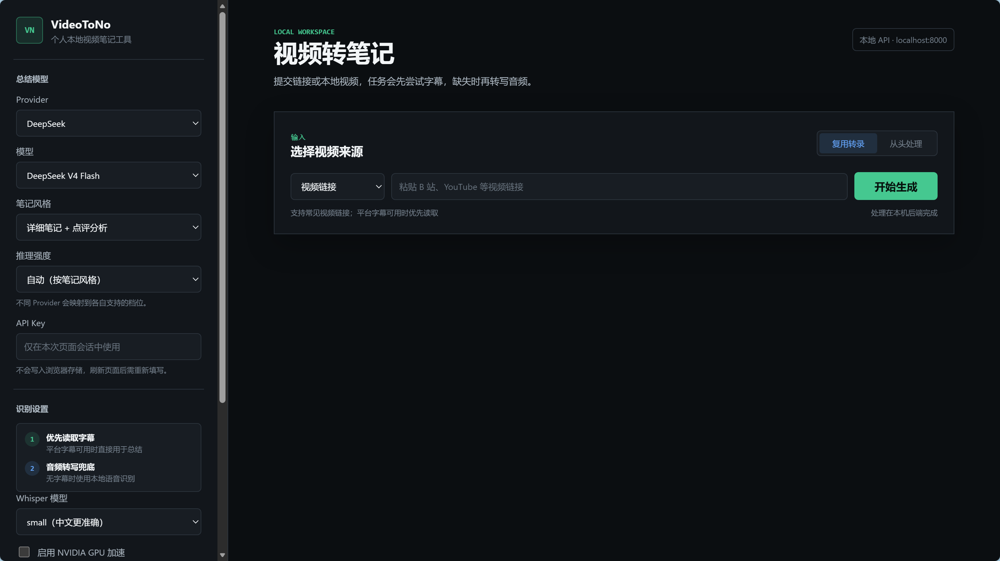
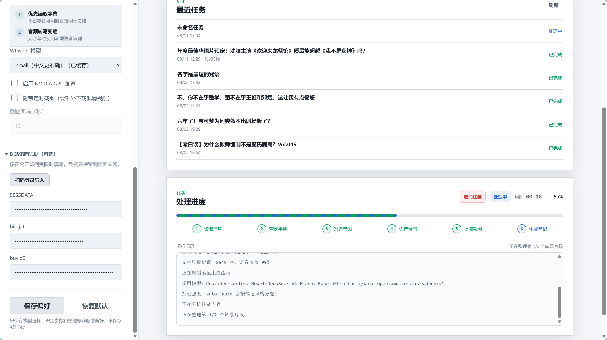
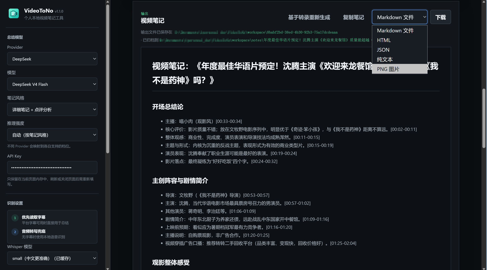

<p align="center">
  
</p>

<h1 align="center">VideoToNo v1.2.2</h1>

<p align="center"><em>Turn videos into Markdown notes you can revisit</em></p>

<p align="center">🌐 <a href="README.md">简体中文</a> · <a href="README_EN.md">English</a></p>

<p align="center"><span style="white-space: nowrap;"><a href="https://github.com/like-attract/video-to-note/releases/latest"></a>&nbsp;<a href="LICENSE"></a>&nbsp;&nbsp;&nbsp;</span></p>

<p align="center"><a href="https://github.com/like-attract/video-to-note/releases/latest"><strong>⬇️ Download the Windows portable build</strong></a></p>

<p align="center">🎬 Promo video (Bilibili): <a href="https://www.bilibili.com/video/BV1Qwby6DEu1/">https://www.bilibili.com/video/BV1Qwby6DEu1/</a> &nbsp;·&nbsp; 👥 QQ group: <code>739200648</code></p>

VideoToNo turns the **"video → structured notes" pipeline** into a local-first service: give it a Bilibili, Douyin, YouTube link or a local video; it prefers platform captions including Bilibili AI captions, falls back to local faster-whisper transcription when none exist, then has your chosen LLM write timestamped Markdown notes. 

> 🤖 **Agent Skill available**: copy the `skills/video-to-note/` directory from this repo into your agent's skills directory (e.g. `~/.agents/skills/`) and coding agents like Claude Code or pi can generate video notes from a single sentence. See `SKILL.md` inside that directory.

## 🆕 What's New (v1.2.1 → v1.2.2)

- **Agent Skill integration**: new `skills/video-to-note/` (SKILL.md + a one-command submit/poll/fetch script) — skill-capable agents like Claude Code or pi can now generate video notes from a single sentence; the third access form alongside the desktop app and MCP
- **Windows task notifications**: in packaged tray mode, task completion/failure pops a system toast — no more watching the page
- Repositioned the repo and docs: a local-first "video → structured notes" service with three access forms

<details>
<summary>Previous releases (v1.2.1 and earlier)</summary>

- **v1.2.1**: immediate cancellation across all stages (LLM streaming/download hooks/model download per-chunk), upload limit 2 GB + auto audio extraction for large videos, Whisper base model bundle
- **v1.2.0**: Bilibili multi-part support, per-segment Whisper cancellation, false-positive SESSDATA fix, manual Whisper model import UI
- **v1.1.8**: run-mode & app-version service isolation, recent-task scrollbar, faithful-note metadata de-duplication, custom Base URL diagnostics
- **v1.1.7**: single public Douyin links, browser-verification fallback, transcript reuse, and cancelled-task deletion.
- **v1.1.6**: persistent Whisper download confirmation and packaged custom-workspace fixes.
- **v1.1.5**: stale-page, MCP SSE, and startup-warning fixes.
- **v1.1.4**: note metadata, tray update checks, more reliable Bilibili downloads, and Whisper fallback improvements.
- **v1.1.3 and earlier**: Bilibili 412 handling, LLM connection testing, MCP integration, long-video chunking, task recovery, and multi-format exports.

</details>

## 🖼️ Screenshots

### ⚙️ Configuration

<p align="center"></p>

### ⏳ Processing

<p align="center"></p>

### 📝 Generated note

<p align="center"></p>

## 🚀 Portable build (recommended)

No Python or development setup is required. Download `VideoToNo-1.2.2-portable.exe` from the [latest Release](https://github.com/like-attract/video-to-note/releases/latest):

1. Download and double-click the exe;
2. Wait for the local page to open in your browser;
3. Enter a provider, model, and API key, then paste a video URL or upload a local file;
4. Generate and review your note.

The portable build starts the local service and stays in the system tray. The first Whisper transcription downloads a model, so keep the network available. Tasks, transcripts, screenshots, and notes are stored under `workspace/` next to the exe by default.

## ✨ Highlights

- 🎥 **Flexible inputs**: Bilibili, Douyin, YouTube, other URLs supported by the installed `yt-dlp`, and local audio/video files.
- 🇨🇳 **Bilibili integration**: fetches Bilibili AI captions after sign-in, with QR-code credential import in the UI.
- 🎵 **Douyin single-link integration**: handles public share links directly and can retry after manual verification in an isolated local browser.
- 🧾 **Real timestamps**: keeps segment start and end times from captions or Whisper instead of asking the model to invent them.
- 🧠 **Long-transcript handling**: chunks, summarizes, and reduces long material while keeping context pressure under control.
- 🖼️ **Multiple exports**: Markdown, HTML, JSON, plain text, and PNG, with optional video screenshots as note attachments.
- 🛡️ **Local-first**: media downloads, transcription, and file generation happen locally; the service listens on `127.0.0.1` by default.

## 🔁 Processing pipeline

```text
Video URL / local file
        ↓
Platform captions (Bilibili AI captions first)
        ↓ when unavailable
Local faster-whisper transcription
        ↓
LLM-generated timestamped Markdown note
```

## 🌍 Supported inputs

- Bilibili, Douyin, YouTube, and other `http` / `https` video URLs that the installed `yt-dlp` can parse;
- single public Douyin share links, with an isolated local browser available for sign-in or verification when anonymous parsing is restricted;
- local `.mp3`, `.m4a`, `.wav`, `.flac`, `.aac`, `.mp4`, `.mkv`, `.mov`, `.webm`, and `.avi` files;
- iQiyi and Tencent Video are not specially adapted, so support depends on access permissions, caption availability, and `yt-dlp` behavior.

## ⚙️ Use and configure

After starting the app:

1. Choose a provider and model, enter an API key, or provide a custom OpenAI-compatible endpoint;
2. Choose a note style, reasoning effort, and Whisper model;
3. Paste a video URL or upload a local file;
4. Preview, copy, or download the generated note.

API keys and QR-login Bilibili cookies stay in the current page/process by default. They are written as plaintext under the local `workspace/` only when an MCP save tool is explicitly used; do not share those files.

<details>
<summary>🧑‍💻 Source use and building (developers)</summary>

If you want the source, use `git clone` or GitHub **Code → Download ZIP**. The project targets Windows + Python 3.11; install `backend/requirements.txt` and use `start.ps1` to run it:

```powershell
git clone https://github.com/like-attract/video-to-note.git
cd video-to-note
.\.venv\Scripts\python.exe -m pip install -r backend\requirements.txt
.\start.ps1
```

Build a Windows portable executable with:

```powershell
powershell -ExecutionPolicy Bypass -File scripts\build_exe.ps1
```

</details>

<details>
<summary>🤖 MCP / AI clients (advanced)</summary>

VideoToNo includes an MCP (Model Context Protocol) server, so AI clients such as Cherry Studio and Codex can turn a video link into a note directly. **Start VideoToNo first**: MCP tasks run through the local backend and reuse its Whisper model cache and task directories.

Available tools:

| Tool | Description |
|---|---|
| `summarize_video` | Submit a video summarization task; URL, API key, model, and Bilibili credentials can be omitted when saved local config is available |
| `wait_for_task` | Wait for a terminal task state for up to 45 seconds per call and return the note when complete; use it instead of aggressive polling |
| `get_task_status` | Inspect intermediate task progress |
| `list_whisper_models` | Show local Whisper model cache status |
| `save_llm_config` | Save provider, model, and API key locally so they do not need to be passed again |
| `save_bilibili_credentials` | Save Bilibili credentials such as SESSDATA for automatic use with Bilibili videos |
| `get_saved_config` | View saved configuration status with secrets masked |

### Cherry Studio (recommended; no local Python needed)

1. Start VideoToNo, then open Cherry Studio **Settings → MCP Servers → Add**;
2. Choose **Server-Sent Events (SSE)** and enter:

```text
http://127.0.0.1:8000/mcp/sse
```

Use the actual port if it is not 8000. Save and enable the server, then ask the AI client to use VideoToNo.

For first-time use, ask the AI to save your configuration once. You will not need to repeat sensitive information in later conversations:

```text
Please call save_llm_config to save my configuration: my DeepSeek API key is sk-xxx.
Then call save_bilibili_credentials to save: sessdata=xxx, bili_jct=xxx, buvid3=xxx.
```

Afterward, simply ask for what you need:

```text
Summarize this Bilibili video: https://www.bilibili.com/video/BV1xx
```

### Codex CLI

For stdio clients such as Codex:

```bash
codex mcp add local videotono -- python -m backend.mcp_server
```

The MCP server automatically scans ports 8000–8019 to locate a running VideoToNo service. Set `VIDEOTONOTES_BACKEND_URL` to explicitly choose the backend URL.

> Privacy: `save_llm_config` and `save_bilibili_credentials` store plaintext files under the local workspace: `workspace/llm_config.json` and `workspace/bili_credentials.json`. Do not share them. Nothing is persisted unless you explicitly call a save tool; `workspace/` is excluded by `.gitignore` and is not committed to this repository.

</details>

<details>
<summary>🧩 Agent Skill (advanced)</summary>

Besides MCP, VideoToNo also ships an **Agent Skill** (`skills/video-to-note/`) for skill-capable coding agents such as Claude Code and pi: the agent reads `SKILL.md`, then drives the bundled script through the full flow — submit a task, stream progress, and fetch the finished note. **Start VideoToNo first**; like MCP, tasks run through the local backend.

### Install

Copy the whole `skills/video-to-note/` directory from this repo into your agent's skills directory, for example:

```text
C:\Users\<you>\.agents\skills\video-to-note\        # pi / common convention
~/.claude/skills/video-to-note/                       # Claude Code
```

### Usage

After installing, just ask in one sentence:

```text
Turn this Bilibili video into notes: https://www.bilibili.com/video/BV1xx
```

The agent invokes the bundled `scripts/video_note.py`, which auto-detects the service port, submits the task, streams runtime logs, and prints (or saves) the full Markdown note. Common options: `--style detailed|faithful|concise`, `--wait seconds`, `--out file`; a local video file path works as input too.

> First use requires an LLM API key: the agent will ask for it — pass it via `--provider` / `--api-key`; or save it once with the MCP `save_llm_config` tool and it is no longer needed.

</details>

<details>
<summary>❓ FAQ</summary>

### Why does the first transcription take so long?

`faster-whisper` downloads a model the first time that model is used. Download time depends on model size and network conditions. The local cache is reused later, but choosing another model can trigger another download.

Models are cached under `workspace/_model_cache/` by default. Set `WHISPER_CACHE_DIR` in `.env` to use another disk. Downloads use the **hf-mirror.com mirror** by default with resume and retry support; set `HF_ENDPOINT` to switch sources, for example `HF_ENDPOINT=https://huggingface.co` for the official host. If downloads still fail, check network connectivity, proxy settings, and write access to the cache directory.

The app disables Hugging Face's Xet download backend by default and uses regular HTTP downloads to avoid CAS reconstruction failures on some Windows networks. If the selected model is incomplete but a usable `base` model is already cached, the job falls back to `base` and records that decision in the task log rather than waiting indefinitely for a weight download.

### What if large models (medium and above) keep failing to download?

Large models are big (medium ≈ 1.5 GB) and prone to interruptions on unstable networks. Besides retrying (resume supported), you can import a model manually:

1. Pick the model under the transcription settings and click "**手动导入模型**" (Import model manually). The app opens the import folder (`workspace/_model_cache/manual/<model>/`);
2. Download the model's 4 files in a browser: `config.json`, `model.bin`, `tokenizer.json`, `vocabulary.txt` from `https://hf-mirror.com/Systran/faster-whisper-<model>/tree/main`;
3. Drop the 4 files into that folder unchanged. The app detects them within seconds and marks the model as cached.

Downloads and cached files are verified for integrity; corrupt leftovers from interrupted downloads are cleaned up and re-downloaded automatically.

### Why is CPU transcription slower than the video duration?

Speed depends on CPU performance, media duration, and model size. CPU mode uses `int8` to reduce resource pressure, but `medium`, `large-v3`, and `turbo` can still be slow and memory-intensive. Start with `base` on a personal computer, and enable GPU mode only after confirming CUDA works correctly.

### Why would I need a Bilibili cookie?

Publicly accessible videos normally do not need one. Some visible Chinese AI captions are returned only by signed-in caption endpoints; without credentials, the app records the reason and falls back to Whisper. Signed-in, restricted, or caption-limited videos may need credentials for an account that already has access. A cookie cannot grant permissions the account does not have, can expire, and may stop working when the platform changes its rules.

### What happens to tasks after restarting the service?

VideoToNo restores recent tasks from `workspace/<task-id>/task.json`. Completed tasks remain available for preview and download, and uploaded tasks that have not started can be submitted again. A task that was running during restart is marked failed because external downloads, Whisper, and LLM requests cannot continue across processes; already generated captions, transcripts, and audio can still be reused on a later submission.

### Why can a particular URL not be processed?

First confirm that it plays in the current network and account, then update the project's `yt-dlp` dependency. Paid content, DRM, CAPTCHAs, region restrictions, expired signatures, and platform API changes can all prevent extraction. This project does not bypass platform access controls.

### What happens when no captions are available?

The app downloads the best available audio stream and runs `faster-whisper` locally. This takes longer than using captions and is affected by audio quality, accents, background noise, and domain-specific vocabulary.

### Why does the log say that the model returned no body and reasoning was disabled for a retry?

That message means the model actually returned an empty body; it is not merely a display issue. The app reports it immediately at the current generation stage and retries once with reasoning disabled. If the retry is also empty, the task follows its actual error path.

</details>

## 📄 License

This is a local personal-use tool released under the [MIT License](LICENSE).
